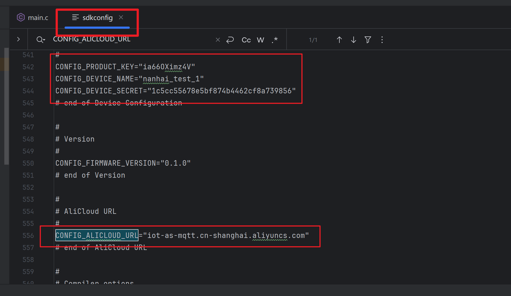

# myy-hardware

myy项目硬件仓库

## 技术栈

- C/C++ (编程语言)
- ESP IDF (框架)
- CMake (构建系统)

## 参考文档

- ESP IDF文档 [Doc](https://docs.espressif.com/projects/esp-idf/zh_CN/latest/esp32s3/versions.html)

## 构建

使用`idf.py`或在`sdkconfig.defaults`中配置设备信息

配置后，构建CMake的`app`目标

[//]: # (开发环境的`.env.dev`文件请联系管理员获取。)

## 问题记录

开发过程中踩过的坑可以在这里记录下来，方便后续查阅。

### 环境部署

CLion+ESPIDF

[[ESP32\][环境配置]Clion配置ESP-IDF开发环境，支持编译下载和menucofig_clion espidf-CSDN博客](https://blog.csdn.net/qq_38844263/article/details/123989779)

```
Note: python;;D:/Espressif/frameworks/esp-idf-v5.3.2/components/esptool_py/esptool/esptool.py;--chip;esp32s3 will search for a serial port. To specify a port, set the ESPPORT environment variable.
```

问题是端口一直找啊找 ipf.py -p COM

### 上网配置这里

配置完后重新编译 sdkconfigif



设置下载端口

```cmake
set(ESPPORT "COM5" CACHE STRING "Default serial port")
```

WIFI使用2.4G频段


### foo

bar

